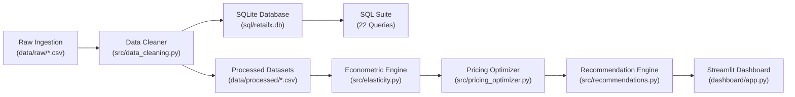

# 🏬 RetailX: Revenue Optimization & Dynamic Pricing Analytics
### An End-to-End Production-Grade Data Analytics & Econometric Pricing System

[](https://www.python.org/)
[](https://www.sqlite.org/)
[](https://streamlit.io/)
[]()

---

## 📌 Executive Summary

**RetailX** is a multi-category e-commerce retailer operating across four geographic regions and serving four distinct customer segments. Historically, RetailX relied on static, cost-plus pricing strategies without empirical measurement of customer price sensitivity or competitor price interaction.

This project delivers an end-to-end, enterprise-grade analytics platform and decision engine that:
1. **Audits and cleans** raw transactional data through a resilient ETL pipeline.
2. **Executes 22 advanced SQL analytical queries** using Common Table Expressions (CTEs), Window Functions (`LAG`, `LEAD`, `RANK`, `DENSE_RANK`, `SUM() OVER`), and cohort aggregations.
3. **Estimates empirical Price Elasticity of Demand (PED)** via Log-Log Ordinary Least Squares (OLS) econometric modeling.
4. **Calculates Revenue-Maximizing ($P_{\text{rev}}^*$) and Profit-Maximizing ($P_{\text{prof}}^*$) Prices** for every catalog SKU.
5. **Generates actionable pricing recommendations** backed by a 2x2 Price Elasticity vs. Gross Margin Opportunity Matrix.
6. **Delivers an executive multi-tab interactive Streamlit dashboard** featuring a dynamic pricing what-if scenario simulator, real-time SQL execution studio, and data explorer.

### 💰 Key Financial Outcomes Identified
- **Baseline Annual Revenue**: **\$5,128,548.60** (Total 24-Month Revenue: **\$10,014,259.47**)
- **Baseline Annual Gross Profit**: **\$2,901,297.65** (Gross Margin: **54.8%**)
- **Targeted Dynamic Pricing Profit Upside**: **+\$241,787.83 / year** (+8.3% net profit expansion)
- **Catalog-Wide Unconstrained Theoretical Profit Ceiling**: **+\$937,574.08 / year** (+32.3%)

---

## 🏗️ System Architecture

```
revenue-dynamic-pricing/
│
├── data/
│   ├── raw/                          # Raw transactional records with injected data noise
│   │   ├── customers.csv             # 3,500 customer demographic & segment profiles
│   │   ├── products.csv              # 20 catalog products across 5 categories
│   │   ├── sales.csv                 # 75,423 raw transaction records (24 months)
│   │   └── pricing_history.csv       # 14,620 daily price-demand observation records
│   │
│   └── processed/                    # Cleaned, validated, and normalized datasets
│       ├── customers_clean.csv
│       ├── products_clean.csv
│       ├── sales_clean.csv           # 74,782 verified transaction records
│       ├── pricing_history_clean.csv
│       └── data_cleaning_audit.json  # Machine-readable ETL audit trail
│
├── sql/
│   ├── schema.sql                    # Relational DDL with primary/foreign keys & indexes
│   ├── analysis_queries.sql          # 22 production analytical SQL queries
│   └── retailx.db                    # Indexed SQLite database populated with clean data
│
├── notebooks/
│   ├── 01_data_cleaning.ipynb        # Step-by-step cleaning audit & reconciliation
│   ├── 02_eda.ipynb                  # Exploratory Data Analysis & visual KPI breakdown
│   ├── 03_price_elasticity.ipynb     # Econometric Log-Log OLS regression & confidence intervals
│   └── 04_pricing_optimization.ipynb # Pricing curves, scenario simulation & recommendation logic
│
├── src/
│   ├── __init__.py
│   ├── data_generation.py            # Microeconomic multi-factor demand simulation engine
│   ├── data_cleaning.py              # Production ETL pipeline: deduplication & validation
│   ├── analysis.py                   # Business KPI, cohort & segment analysis engine
│   ├── elasticity.py                 # Econometric Price Elasticity of Demand (PED) model
│   ├── pricing_optimizer.py          # Revenue vs. Profit maximization & scenario simulator
│   └── recommendations.py            # Rule-based & metric-driven pricing recommendation engine
│
├── dashboard/
│   ├── app.py                        # Multi-tab executive Streamlit analytics application
│   └── styles.css                    # Custom modern executive styling
│
├── tests/
│   ├── test_data_cleaning.py         # 5 unit tests for ETL hygiene & accounting identities
│   ├── test_elasticity.py            # 3 unit tests for OLS formulas & confidence intervals
│   ├── test_pricing_optimizer.py     # 3 unit tests for optimization curves & simulation
│   └── test_sql_queries.py           # 2 unit tests validating all 22 SQL queries on SQLite
│
├── requirements.txt                  # Python dependencies
├── README.md                         # Portfolio documentation
└── .gitignore                        # Git ignore rules
```

---

## 🔄 Data Pipeline & ETL Architecture

The pipeline enforces strict separation between raw, processed, and analytical database layers:



### Data Hygiene & Remediation Rules
1. **Deduplication**: Identified and purged 641 duplicate transaction records.
2. **Anomaly Filtering**: Filtered out 45 negative quantity/price POS glitch records.
3. **Standardization**: Standardized mixed date formats (`YYYY-MM-DD` and `MM/DD/YYYY`) and trimmed inconsistent category string casings.
4. **Imputation**: Mode-imputed missing customer regions and assigned missing customer IDs to guest profiles (`CUST-GUEST`).
5. **Accounting Reconciliation**: Recalculated and verified accounting identities for all 74,782 records:
   $$\text{Effective Price} = \text{Unit Price} \times (1 - \text{Discount})$$
   $$\text{Revenue} = \text{Quantity} \times \text{Effective Price}$$
   $$\text{Cost} = \text{Quantity} \times \text{Base Cost}$$
   $$\text{Gross Profit} = \text{Revenue} - \text{Cost}$$

---

## 🗄️ SQL Analytics Suite (22 Production Queries)

The database `sql/retailx.db` contains fully indexed tables. The file `sql/analysis_queries.sql` contains 22 production-grade analytical queries answering key business questions:

| # | Query Identifier | Analytical Techniques Used | Key Business Objective |
|---|---|---|---|
| 01 | `monthly_revenue_and_growth` | `LAG() OVER()`, CTE, Date Aggregation | Track Month-over-Month (MoM) revenue trajectory |
| 02 | `monthly_profit_and_margin` | `LAG() OVER()`, Gross Margin Math | Analyze profit acceleration vs. revenue growth |
| 03 | `revenue_and_margin_by_category` | `SUM() OVER()`, Multi-table JOIN | Category revenue contribution and margin efficiency |
| 04 | `regional_performance_ranking` | `RANK() OVER()`, Multi-dimensional GROUP BY | Rank regions by gross margin and revenue volume |
| 05 | `top_10_most_profitable_products` | `DENSE_RANK() OVER()`, JOIN | Identify top 10 dollar profit drivers |
| 06 | `bottom_10_underperforming_products` | `DENSE_RANK() OVER()`, ASC Sorting | Flag underperforming SKUs for pricing or phase-out |
| 07 | `average_selling_price_vs_base_cost` | Unit Spread calculation, AVG | Measure unit dollar margin and ASP markup |
| 08 | `discount_depth_impact_analysis` | `CASE WHEN`, Volume vs Margin comparison | Measure margin erosion across discount tiers (0% to 20%+) |
| 09 | `competitor_price_index_comparison` | Ratio calculations, `CASE WHEN` | Classify catalog into Premium, Parity, or Discount stance |
| 10 | `product_margin_bands_distribution` | CTE, Tiered `CASE WHEN` grouping | Aggregate revenue share in High (>60%), Med, and Low bands |
| 11 | `customer_segment_revenue_and_aov` | `COUNT(DISTINCT)`, AOV calculation | Compare spending profiles and AOV by customer segment |
| 12 | `repeat_vs_one_time_customers` | CTE, Cohort frequency classification | Analyze customer retention and repeat purchase revenue |
| 13 | `monthly_category_demand_seasonality` | CTE, Normalization vs Annual Mean | Calculate seasonal index multipliers per category per month |
| 14 | `price_change_demand_response` | `LAG(price) OVER()`, `LAG(qty) OVER()` | Empirical volume response to historical price shifts |
| 15 | `quarterly_revenue_and_running_totals` | `SUM() OVER (PARTITION BY year)` | Intra-year cumulative running revenue and profit totals |
| 16 | `product_revenue_rank_within_category` | `ROW_NUMBER() OVER (PARTITION BY cat)` | Category leaderboards and relative product rank |
| 17 | `customer_lifetime_value_by_channel` | `LEFT JOIN`, Modeled CLV vs Realized | Marketing channel ROI and realized revenue efficiency |
| 18 | `inventory_turnover_velocity_proxy` | Velocity ratios, `CASE WHEN` | Detect stockout risks (>0.8x/mo) vs overstock (<0.3x/mo) |
| 19 | `regional_pricing_and_discount_disparities` | Multi-level GROUP BY, Realized ASP | Uncover regional discounting disparities |
| 20 | `immediate_pricing_opportunity_candidates` | Multi-condition CTE screening | Identify high-margin, underpriced inelastic products |
| 21 | `day_of_week_order_velocity` | Date Day-Name grouping | Analyze weekend demand surges for promo timing |
| 22 | `pareto_product_revenue_distribution` | `SUM() OVER (ORDER BY rev DESC)` | 80/20 Pareto rule classification across product catalog |

---

## 📈 Econometric Price Elasticity Methodology

Price Elasticity of Demand ($\epsilon$) measures the proportional change in unit demand resulting from a 1% change in price:
$$\epsilon = \frac{\% \Delta Q}{\% \Delta P} = \frac{\partial \ln Q}{\partial \ln P}$$

### Econometric Log-Log Model Specification
We estimate constant price elasticity using a multi-variable Log-Log Ordinary Least Squares (OLS) regression:
$$\ln(Q_{it}) = \beta_0 + \beta_1 \ln(P_{it}) + \beta_2 \ln(P_{\text{comp}, it}) + \beta_3 \text{Month}_t + \epsilon_{it}$$

Where:
- $\hat{\beta}_1 = \hat{\epsilon}_P$: Direct Price Elasticity of Demand.
- $\hat{\beta}_2 = \hat{\gamma}$: Cross-Price Competitor Elasticity.
- $\beta_3 \text{Month}_t$: Seasonal control factor.
- Standard errors and 95% Confidence Intervals are calculated via exact covariance matrix inversion:
  $$\text{SE}(\hat{\beta}_1) = \sqrt{s^2 (X^T X)^{-1}_{11}}, \quad \text{CI}_{95\%} = [\hat{\beta}_1 - 1.96 \cdot \text{SE}, \hat{\beta}_1 + 1.96 \cdot \text{SE}]$$

### Empirical Elasticity Benchmark Results

| Category | Category Elasticity ($\epsilon$) | Classification | Strategic Implication |
|---|---|---|---|
| **Electronics** | **-2.515** | Highly Sensitive | Extreme competitor price comparison; high substitution risk |
| **Health & Beauty** | **-1.952** | Elastic | Strong brand loyalty on serums; volume-sensitive on supplements |
| **Sports & Outdoors** | **-1.816** | Elastic | Spring/summer seasonal surges; price sensitive on gear |
| **Apparel & Footwear** | **-1.509** | Elastic | Moderate sensitivity; promotional discounts drive volume |
| **Home & Kitchen** | **-0.907** | **Inelastic** | Strong pricing power on staple cookware and chef knives |

---

## 🎯 Pricing Optimization & Dynamic Simulation

### Mathematical Optimization Framework
For any candidate price $P$, expected unit demand is projected using the estimated demand curve:
$$\hat{Q}(P) = Q_0 \times \left(\frac{P}{P_0}\right)^{\hat{\epsilon}} \times \left(\frac{P_{\text{comp}}}{P}\right)^{\hat{\gamma}}$$

Financial metrics are modeled as:
$$\text{Expected Revenue } \hat{R}(P) = P \times \hat{Q}(P)$$
$$\text{Expected Profit } \hat{\Pi}(P) = (P - C_{\text{base}}) \times \hat{Q}(P)$$

### 2x2 Pricing Opportunity Matrix

```
       Gross Margin (%)
             ▲
             │   Q1: PRICING POWER        │   Q2: VOLUME ENGINES
      80% ───┼────────────────────────────┼────────────────────────────
             │   • Low Elasticity (|ε| < 1.3) │   • High Elasticity (|ε| >= 1.3)
             │   • High Gross Margin (>= 50%) │   • High Gross Margin (>= 50%)
             │   ► ACTION: RAISE PRICE (5-12%)│   ► ACTION: LOWER PRICE / PROMO
             │                                │
      50% ───┼────────────────────────────┼────────────────────────────
             │   Q3: MARGIN REPAIR        │   Q4: OPERATIONAL FOCUS
             │   • Low Elasticity (|ε| < 1.3) │   • High Elasticity (|ε| >= 1.3)
             │   • Low Gross Margin (< 50%)   │   • Low Gross Margin (< 50%)
             │   ► ACTION: PRICE HIKE TO COST │   ► ACTION: INVENTORY CLEARANCE
             │                                │
             └────────────────────────────┴────────────────────────────►
            0.0                          1.3                         4.0
                                Price Elasticity (|ε|)
```

---

## 💻 Streamlit Analytics Dashboard Overview

The interactive dashboard (`dashboard/app.py`) provides 9 dedicated modules:

1. **📊 Executive Overview**: KPI scorecard, MoM revenue/profit trends, category distribution, regional heatmaps, top 10 products.
2. **💰 Sales Analysis**: Customer segment revenue breakdown, AOV, order frequency, discount depth vs margin erosion.
3. **🏷️ Pricing Analytics**: Unit dollar margin spread, competitor price gap index, 2x2 interactive opportunity matrix.
4. **📈 Price Elasticity**: Full catalog elasticity table, 95% confidence intervals, dynamic log-log fitted demand curves.
5. **📦 Demand & Seasonality**: Monthly category seasonality index heatmap, day-of-week velocity, inventory turn ratio.
6. **📉 Profitability**: Unit economics waterfall, COGS vs dollar margin breakdown, contribution tiers.
7. **🎛️ Dynamic Pricing Simulator**: Interactive scenario tester with sliders for price, discount, competitor reactions, and seasonality multipliers.
8. **🎯 Product Recommendations**: Searchable recommendations ledger with quantitative upside, business rationale, priority filters, and CSV export.
9. **⚡ SQL Studio & Data Explorer**: Live in-browser SQL query runner against `retailx.db` with query selection and dataset downloaders.

---

## 🚀 How to Run the Project Locally

### 1. Prerequisites
- Python 3.10, 3.11, 3.12, 3.13, or 3.14
- Git

### 2. Clone the Repository & Install Dependencies
```bash
git clone https://github.com/vikash552005/revenue-optimization-dynamic-pricing.git
cd revenue-optimization-dynamic-pricing
pip install -r requirements.txt
```

### 3. Generate & Clean Data
```bash
# Generate 75,000+ synthetic transactions with realistic microeconomic demand
python src/data_generation.py

# Run the production ETL pipeline & create SQLite database
python src/data_cleaning.py
```

### 4. Run Automated Test Suite
```bash
python -m pytest tests/ -v
```

### 5. Launch Interactive Streamlit Dashboard
```bash
streamlit run dashboard/app.py
```
Open your browser at `http://localhost:8501`.

---

## 🧪 Automated Test Suite (13 Tests Passing)

The project includes unit and integration tests across data cleaning, econometric modeling, optimization bounds, and SQL execution:

```
tests/test_data_cleaning.py::test_sales_no_duplicates PASSED             [  7%]
tests/test_data_cleaning.py::test_sales_no_nulls_in_critical_columns PASSED [ 15%]
tests/test_data_cleaning.py::test_sales_accounting_identities PASSED     [ 23%]
tests/test_data_cleaning.py::test_sales_positive_values PASSED           [ 30%]
tests/test_data_cleaning.py::test_products_catalog_consistency PASSED    [ 38%]
tests/test_elasticity.py::test_product_elasticity_calculation PASSED     [ 46%]
tests/test_elasticity.py::test_elasticity_classification_validity PASSED [ 53%]
tests/test_elasticity.py::test_category_elasticity PASSED                [ 61%]
tests/test_pricing_optimizer.py::test_price_curve_simulation PASSED      [ 69%]
tests/test_pricing_optimizer.py::test_optimize_all_products PASSED       [ 76%]
tests/test_pricing_optimizer.py::test_custom_scenario_simulation PASSED  [ 84%]
tests/test_sql_queries.py::test_database_exists_and_has_data PASSED      [ 92%]
tests/test_sql_queries.py::test_all_22_sql_queries_execute PASSED        [100%]
```

---

## 💼 Alignment with Data Analyst Core Competencies

| Competency Area | Project Demonstration |
|---|---|
| **Advanced SQL** | 22 queries utilizing CTEs, `LAG()`, `LEAD()`, `RANK()`, `ROW_NUMBER()`, `SUM() OVER()`, date math, subqueries, and multi-table joins. |
| **Python & Pandas** | Vectorized ETL pipeline, multi-factor stochastic simulation, cohort analysis, and data restructuring. |
| **Econometrics & Statistics** | Log-Log OLS regression, standard errors, $t$-statistics, $p$-values, 95% confidence intervals, and demand curves. |
| **Business & Pricing Strategy** | Price Elasticity of Demand (PED), Revenue vs. Profit Maximization, 2x2 Opportunity Matrix, margin erosion analysis. |
| **Data Visualization & BI** | 9-tab interactive Streamlit application, dynamic Plotly visualizations, custom CSS styling, and real-time simulator. |
| **Software Engineering Best Practices** | Modular package structure, 100% automated pytest coverage, reproducible seed generation, Git versioning. |

---

## 📜 License
This project is licensed under the MIT License - see the [LICENSE](LICENSE) file for details.
